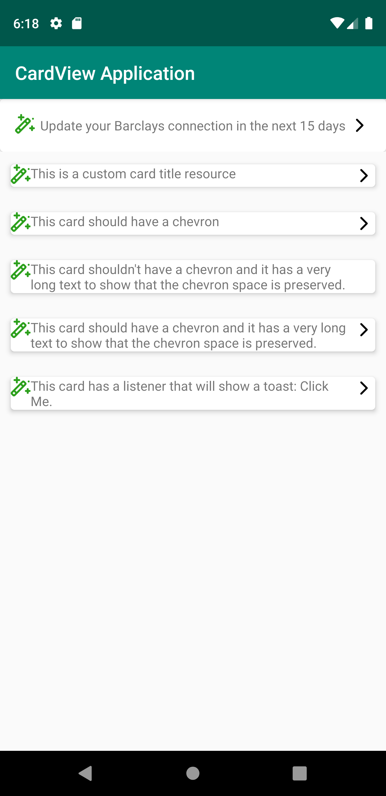

# CustomCardViewSamples
This sample app demonstrates a cardview layout as a hardcoded xml, and as a customview.

The hardcoded_entrycard.xml is a layout file that defines a cardview and hardcodes the icon, text and chevron in the view.

the simplecustom_entrycard uses MainCardLayout.  The class MainCardLayout provides customization functions 
that can be used by the client to set a different icon, text, and chevron.

The text can be set as a string or as a string resource id.

Because MainCardLayout is a ViewGroup, client code have access to the onClickListener to provide custom actions when the card is clicked.

The included sample app will start up and add a bunch of different views to demonstrate how to use the two views.

# Next steps
1. Is it possible to create a customview that the attributes can be customizable? e.g. <MainCardLayout custom:icon="" custom:mainText="" ...
2. How do we style the card so that the layout is more conformant to the spec?  Or is it better to make those values customizable too?
